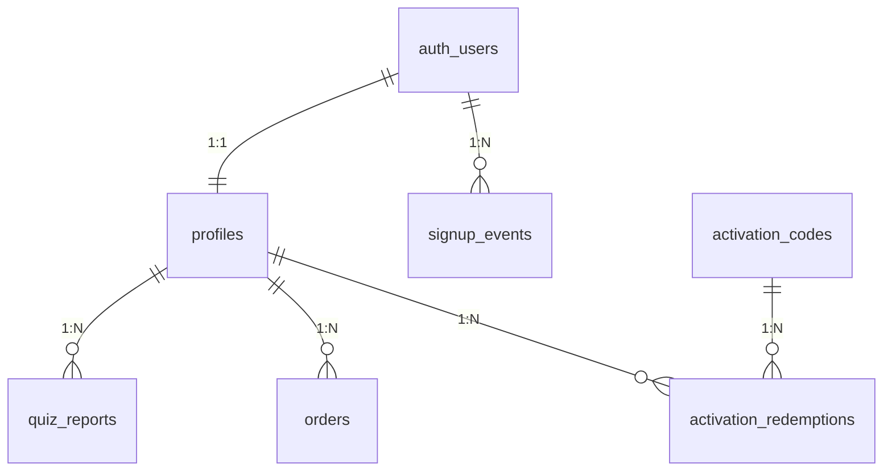

# Testar Supabase 正式迁移方案

日期：2026-03-23  
范围：仅面向当前代码库 `/Users/ln/testar-latest`  
目标：让 Supabase 数据模型、关系、RLS 与当前前端/Edge Function 真实依赖保持一致，并为后续激活码和支付能力留出可持续扩展空间。

## 1. 当前状态摘要

### 1.1 当前代码实际依赖

当前代码已经不是旧版的“随机文本用户 ID + mock 登录”。

- 认证：使用 `supabase.auth.signInWithPassword` / `signUp`
- 用户主键来源：期望使用 `auth.users.id`
- 业务表：
  - `profiles`
  - `quiz_reports`
  - `orders`
- 当前代码还依赖但数据库未提供的能力：
  - `profiles.metadata.is_base_vip`
  - `signup_events`
  - 激活码落库与核销审计

关键证据：

- [src/store/useQuizStore.ts](/Users/ln/testar-latest/src/store/useQuizStore.ts)
- [src/components/home/AuthModal.tsx](/Users/ln/testar-latest/src/components/home/AuthModal.tsx)
- [supabase/functions/create-payment/index.ts](/Users/ln/testar-latest/supabase/functions/create-payment/index.ts)
- [supabase/functions/payment-webhook/index.ts](/Users/ln/testar-latest/supabase/functions/payment-webhook/index.ts)

### 1.2 线上数据库当前状态

通过 Supabase Data API 只读探测，当前线上公开表只有：

- `profiles`
- `quiz_reports`
- `orders`

线上字段现状：

- `profiles.id` 是 `text`
- `quiz_reports.user_id` 是 `text` 外键到 `profiles.id`
- `orders.user_id` 是 `text` 外键到 `profiles.id`
- `profiles` 没有 `metadata`

这意味着当前线上库仍然更接近旧版 mock 用户模型，而不是当前代码想要的 `auth.users -> profiles` 模型。

## 2. 迁移目标

### 2.1 目标原则

- 所有用户主链路统一以 `auth.users.id (uuid)` 为准
- `profiles` 作为业务档案表，不再使用文本用户 ID
- 测评记录、订单、激活码核销全部基于 `uuid` 用户关系
- 保留现有 `quiz_reports.metadata jsonb` 方案，避免重构报告结构
- 新注册用户必须可审计，可回溯
- 激活码必须可核销、可追踪、可防重复

### 2.2 推荐迁移策略

推荐采用“影子表迁移 + 分阶段切换”，不要直接原地 `ALTER COLUMN text -> uuid`。

原因：

- 旧数据里大概率存在 `U-12345` 这一类非 UUID 用户 ID
- 直接改类型会让迁移失败，或迫使我们做高风险脏数据强转
- 当前仓库没有 migration 体系，影子表方式更易回滚

## 3. 方案对比

### 方案 A：原地改现有表字段类型

做法：

- 直接把 `profiles.id`、`quiz_reports.user_id`、`orders.user_id` 从 `text` 改成 `uuid`

优点：

- 表名不变
- SQL 数量少

缺点：

- 遇到旧版文本 ID 会直接卡住
- 回滚难
- 容易在迁移中把旧数据做坏

结论：不推荐。

### 方案 B：影子表迁移后切换

做法：

- 新建 `profiles_v2`、`quiz_reports_v2`、`orders_v2`
- 新增 `signup_events`、`activation_codes`、`activation_redemptions`
- 回填可迁移数据
- 验证通过后改名切换

优点：

- 可审计
- 可回滚
- 能隔离旧版脏数据

缺点：

- 迁移脚本更长
- 需要一次明确切换窗口

结论：推荐。

### 方案 C：保持数据库不动，只改前端兼容旧库

做法：

- 继续让前端把 `auth.users.id` 当字符串使用
- 去掉 `profiles.metadata`
- 激活码继续前端前缀判断

优点：

- 改动少

缺点：

- 数据模型继续漂移
- 没有真正的审计和安全边界
- 激活码依然不可信

结论：仅适合作为临时止血，不适合作为正式方案。

## 4. 目标数据模型

### 4.1 核心关系

### 4.2 目标表设计

#### `public.profiles`

用途：用户业务档案

建议字段：

- `id uuid primary key references auth.users(id) on delete cascade`
- `nickname text not null`
- `avatar_url text`
- `is_vip boolean not null default false`
- `metadata jsonb not null default '{"is_base_vip": false}'::jsonb`
- `last_login_at timestamptz`
- `created_at timestamptz not null default now()`
- `updated_at timestamptz not null default now()`

说明：

- 保留 `metadata` 是为了兼容当前代码读取 `profile?.metadata.is_base_vip`
- 后续如要长期稳定演进，可以把 `is_base_vip` 升级为显式列

#### `public.quiz_reports`

用途：测评历史记录

建议字段：

- `id uuid primary key default gen_random_uuid()`
- `user_id uuid not null references public.profiles(id) on delete cascade`
- `quiz_id text not null`
- `result_id text not null`
- `scores jsonb not null default '{}'::jsonb`
- `professional_scores jsonb not null default '{}'::jsonb`
- `metadata jsonb not null default '{}'::jsonb`
- `created_at timestamptz not null default now()`

说明：

- 当前代码的报告结构高度动态，继续使用 `metadata jsonb` 是合理的

#### `public.orders`

用途：支付订单与权益同步

建议字段：

- `id uuid primary key default gen_random_uuid()`
- `user_id uuid not null references public.profiles(id) on delete cascade`
- `quiz_id text`
- `product_type text not null`
- `amount numeric(10,2) not null`
- `status text not null default 'pending'`
- `payment_method text`
- `provider_order_id text`
- `order_metadata jsonb not null default '{}'::jsonb`
- `paid_at timestamptz`
- `created_at timestamptz not null default now()`
- `updated_at timestamptz not null default now()`

说明：

- 虽然当前前端主流程已切到激活码，但仓库保留了支付 Edge Functions
- `orders` 应继续保留，作为支付能力回归时的正式表

#### `public.signup_events`

用途：新用户注册审计

建议字段：

- `id uuid primary key default gen_random_uuid()`
- `user_id uuid not null references auth.users(id) on delete cascade`
- `email text not null`
- `provider text not null default 'email_password'`
- `signup_source text not null default 'web'`
- `metadata jsonb not null default '{}'::jsonb`
- `created_at timestamptz not null default now()`

说明：

- 你明确要求“每个新注册用户都记录下来”，这张表是正式承载

#### `public.activation_codes`

用途：激活码主表

建议字段：

- `id uuid primary key default gen_random_uuid()`
- `code text not null unique`
- `tier text not null`
- `status text not null default 'active'`
- `upgrade_requires_base boolean not null default false`
- `max_redemptions integer not null default 1`
- `redeemed_count integer not null default 0`
- `expires_at timestamptz`
- `metadata jsonb not null default '{}'::jsonb`
- `created_at timestamptz not null default now()`
- `updated_at timestamptz not null default now()`

说明：

- 用于替代当前前端“只看前缀”的伪校验

#### `public.activation_redemptions`

用途：激活码核销流水

建议字段：

- `id uuid primary key default gen_random_uuid()`
- `activation_code_id uuid not null references public.activation_codes(id) on delete restrict`
- `user_id uuid not null references public.profiles(id) on delete cascade`
- `effective_tier text not null`
- `metadata jsonb not null default '{}'::jsonb`
- `redeemed_at timestamptz not null default now()`

约束建议：

- 单次码：依赖 `activation_codes.max_redemptions = 1`
- 可复用码：依赖 `redeemed_count < max_redemptions`
- 可按业务决定是否增加 `unique (activation_code_id, user_id)`

## 5. 必要约束、索引、触发器、RLS

### 5.1 索引

至少需要：

- `quiz_reports (user_id, created_at desc)`
- `orders (user_id, created_at desc)`
- `orders (provider_order_id) unique where provider_order_id is not null`
- `signup_events (user_id, created_at desc)`
- `activation_codes (code) unique`
- `activation_redemptions (user_id, redeemed_at desc)`

### 5.2 触发器

建议保留或新增：

- `touch_updated_at()`  
  用于 `profiles`、`orders`、`activation_codes`

- `sync_vip_status()`  
  当 `orders.status = 'completed'` 时同步 `profiles.is_vip = true`

- `handle_new_auth_user()`  
  当 `auth.users` 新增用户时自动创建 `profiles` 与 `signup_events`

### 5.3 RLS

#### `profiles`

- `select`: 仅本人 `auth.uid() = id`
- `update`: 仅本人 `auth.uid() = id`
- `insert`: 不开放给 anon/authenticated 直接写，改为触发器或受控 upsert

#### `quiz_reports`

- `select`: `auth.uid() = user_id`
- `insert`: `auth.uid() = user_id`

#### `orders`

- `select`: `auth.uid() = user_id`
- `insert/update`: 仅 `service_role`

#### `signup_events`

- `insert`: 仅触发器 / `service_role`
- `select`: 仅 `service_role` 或后台管理端

#### `activation_codes`

- 前端不直接读写
- 仅 `service_role` 或后台管理端维护

#### `activation_redemptions`

- `select`: 用户可读自己的核销记录，或只允许后台查询
- `insert`: 仅受控 Edge Function

## 6. 需要同步调整的应用代码

数据库迁移不是孤立动作，当前代码还需要一并调整。

### 6.1 认证与用户态

需要改的点：

- [src/store/useQuizStore.ts](/Users/ln/testar-latest/src/store/useQuizStore.ts)
  - 注册后不要再直接裸插 `profiles`，改为依赖数据库触发器建档，或用受控 `upsert`
  - 登录成功后补 `last_login_at`
  - 新增 `getSession` / `onAuthStateChange` 启动恢复逻辑

- [src/components/home/UserDrawer.tsx](/Users/ln/testar-latest/src/components/home/UserDrawer.tsx)
  - 退出登录不能只清本地状态，必须调用 `supabase.auth.signOut()`

### 6.2 激活码

当前激活码校验只是前缀判断：

- [src/store/useQuizStore.ts](/Users/ln/testar-latest/src/store/useQuizStore.ts#L239)

需要改为：

- 前端调用 `verify-activation-code` Edge Function
- Edge Function 在事务中：
  - 查询 `activation_codes`
  - 校验状态、次数、过期时间、升级前置条件
  - 写入 `activation_redemptions`
  - 更新 `profiles.is_vip` 或 `profiles.metadata.is_base_vip`
  - 更新 `activation_codes.redeemed_count`

### 6.3 支付

当前仓库保留支付函数：

- [supabase/functions/create-payment/index.ts](/Users/ln/testar-latest/supabase/functions/create-payment/index.ts)
- [supabase/functions/payment-webhook/index.ts](/Users/ln/testar-latest/supabase/functions/payment-webhook/index.ts)

但当前前端没有实际调用支付下单函数。

因此建议：

- 当前迁移把 `orders` 表和触发器保留好
- 真正恢复支付前，再补：
  - PSP 签名校验
  - 幂等 webhook
  - `provider_order_id` 唯一约束的完整使用

## 7. 正式迁移步骤

### Phase 0：迁移前审计

1. 导出当前 `profiles`、`quiz_reports`、`orders`
2. 统计 `profiles.id` 中：
   - UUID 格式数量
   - 非 UUID 格式数量
3. 统计能与 `auth.users.id` 对上的记录数量
4. 确认是否已有真实注册用户

### Phase 1：创建新表与支持对象

创建：

- `profiles_v2`
- `quiz_reports_v2`
- `orders_v2`
- `signup_events`
- `activation_codes`
- `activation_redemptions`

同时创建：

- 索引
- 触发器
- RLS
- `orders` realtime publication

### Phase 2：回填旧数据

回填规则：

- 只有当旧 `profiles.id` 能安全转换为 UUID 且确实存在于 `auth.users` 中时，才迁入 `profiles_v2`
- 其关联的 `quiz_reports` / `orders` 才允许继续迁入
- 旧版 `U-12345` 这类记录进入 `legacy_*` 归档，不参与新主链路

推荐保留：

- `legacy_profiles`
- `legacy_quiz_reports`
- `legacy_orders`

### Phase 3：切换代码

在同一次发布中完成：

- 使用新 migration 脚本创建对象
- 修改前端注册、登录、退出、会话恢复
- 修改激活码校验逻辑为服务端核销

### Phase 4：切换表名

推荐顺序：

1. 旧表改名为 `_legacy`
2. 新表改名为正式名
3. 验证 API、RLS、Edge Function 正常

### Phase 5：稳定期观察

观察至少 7 天：

- 注册成功率
- 登录成功率
- `profiles` 建档成功率
- `quiz_reports` 入库成功率
- 激活码核销成功率
- 订单 webhook 幂等情况

确认稳定后再考虑清理 legacy 表。

## 8. 验收标准

迁移完成后，必须满足：

1. 新注册用户会同时出现在 `auth.users`、`profiles`、`signup_events`
2. 登录成功后能正确读取 `nickname`、`is_vip`、`metadata.is_base_vip`
3. 做完测评后 `quiz_reports` 成功落库
4. 历史页能读回用户自己的报告
5. 激活码验证走服务端，不能只靠前缀
6. 退出登录后服务端 session 被真正清除
7. 所有用户主外键链路均为 `uuid`

## 9. 风险与回滚

### 主要风险

- 旧版文本用户 ID 无法映射到 `auth.users`
- 当前代码没有 session 恢复逻辑，发布后可能出现“刷新后丢登录态感知”
- 激活码如果不同时切服务端核销，会继续留下安全洞

### 回滚策略

- 不原地覆盖旧表
- 保留 `_legacy` 表
- 迁移脚本分阶段执行
- 代码发布与表切换分两个明确步骤

## 10. 推荐实施顺序

建议按下面顺序执行：

1. 先做数据库正式迁移脚本
2. 再改前端认证与会话恢复
3. 再接入激活码服务端核销
4. 最后再决定是否恢复支付前台入口

## 11. 本方案的明确结论

本次正式迁移应当以“对齐当前代码”为准，不以旧版 mock 用户体系为准。

因此：

- 用户主键统一升级到 `auth.users.id`
- `profiles` 补齐 `metadata`
- 增加 `signup_events`
- 增加激活码主表与核销流水表
- 旧版文本 ID 数据进入 legacy 归档

这是一条可落地、可回滚、也最适合当前仓库继续演进的正式路径。
